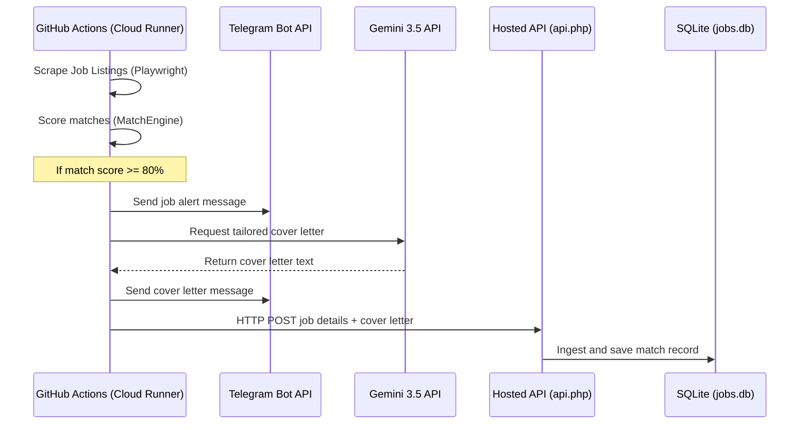

# 💼 JobAgent & Web Dashboard (v2.1)

> An automated, serverless background job search agent and web dashboard that scrapes job boards, evaluates match relevance against a personal resume profile using track-based scoring, generates customized cover letters using **Google Gemini 3.5**, and sends direct Telegram alerts to your phone.

---

## 🚀 Key Features

*   **Multi-Platform Scraper**: Programmatically scrapes **JobStreet (MY)**, **Indeed (SG/MY)**, and **LinkedIn** for junior, fresh-graduate, and associate roles.
*   **Deep-Scraping**: Dynamically traverses listing detail pages to extract full requirements text, ensuring accurate scoring.
*   **Track-Based Scoring Engine**: Evaluates matches across distinct career paths (e.g., Web Development vs. Data Analysis) to prevent match score dilution, with built-in seniority penalties (`-40%` for titles containing "Senior/Lead").
*   **AI Cover Letters**: Auto-generates customized cover letters using the free tier of **Google Gemini 3.5** (`gemini-3.5-flash`) via the `v1beta` API endpoint.
*   **Mobile Telegram Notifications**: Sends beautifully formatted HTML cards directly to your phone via Telegram Bot API for matches meeting the threshold.
*   **Modern Web Dashboard**: Features a lightweight PHP + SQLite frontend hosted on shared hosting (cPanel-friendly) to track job applications, copy letter contents, and download letters as high-fidelity A4 PDFs in one click.
*   **Serverless Cloud Runner**: Configured to run automatically in the cloud every weekday at 9:00 AM MYT using GitHub Actions.

---

## 🛠️ Tech Stack

### Scraper Engine (Python)
- **Playwright**: Headless browser scraping.
- **Httpx**: Fast, asynchronous REST API calls to Google Gemini and Telegram Bot endpoints.
- **Asyncio**: Co-routine event loops for concurrent parsing.
- **Dotenv**: Local environment secrets management.

### Web Dashboard (PHP)
- **PHP**: Router and SQLite DB connector.
- **SQLite**: Self-initializing single-file database for zero-config deployment.
- **Bootstrap 5**: Mobile-responsive UI grid.
- **Vanilla JS**: Front-end interactive handlers.
- **html2pdf.js**: Client-side canvas-to-PDF compiler for downloading cover letters.

---

## 🏗️ Architecture & Data Flow



---

## 📂 Directory Structure

```
jobAgent/
├── .github/workflows/
│   └── scrape_jobs.yml     # GitHub Actions workflow configuration (9:00 AM weekday cron)
├── web/
│   ├── index.php           # Web App View Controller (Stats Dashboard)
│   ├── api.php             # Web App API Router (Ingests scraper matches & updates statuses)
│   ├── css/
│   │   └── style.css       # Premium Dark Glassmorphic styling sheet
│   └── js/
│       └── app.js          # Clipboard copy, status toggling, and PDF export hooks
├── cover_letters/          # Repository archive folder for generated letters
├── agents.py               # Main Python Playwright scraper & engine
├── masterProfile.md        # Candidate professional profile (ATS keywords & resume credentials)
├── requirements.txt        # Python package dependencies
└── README.md               # Project documentation
```

---

## ⚙️ Setup & Deployment

### 1. Upload Web Dashboard to cPanel
1. Compress the contents of the `web` folder into a ZIP file.
2. Log into your **cPanel File Manager** and navigate to your web root (`public_html`).
3. Create a folder named `jobtracker` and upload the ZIP file contents there.
4. Set a secure API handshake key on line 10 of `web/api.php`:
   ```php
   $API_KEY = "YourSecureAPIKeyHere";
   ```

### 2. Configure GitHub Secrets
Push this repository to GitHub and go to **Settings** ➔ **Secrets and variables** ➔ **Actions** ➔ **New repository secret**. Configure the following 5 secrets:

*   `TELEGRAM_BOT_TOKEN`: Token obtained from `@BotFather`.
*   `TELEGRAM_CHAT_ID`: Chat ID obtained from `@userinfobot`.
*   `GEMINI_API_KEY`: API Key obtained from **Google AI Studio** (starts with `AQ.` or `AIzaSy`).
*   `DASHBOARD_URL`: `https://yourdomain.com/jobtracker/api.php`
*   `DASHBOARD_API_KEY`: The matching API key configured in your `api.php`.

### 3. Local Development Run
If you want to test the scraper locally on your machine, create a `.env` file in the root directory matching your settings and execute:
```bash
pip install -r requirements.txt
playwright install chromium
python agents.py --once
```

---

## 📜 License
This project is open-source and available under the MIT License.
